# SaaS公司如何赚钱：从想法到盈利的真实路径

---

也许这就是你的故事：前不久，你还坐在格子间里，被某个低效流程折磨得够呛。突然灵光一现——作为程序员，你完全可以自己动手解决这个问题。于是你开始写代码，改了好几版，找朋友测试，终于搞出了一个像样的产品。更意外的是，周围人也有同样的痛点，你的产品突然变得抢手起来。现在问题来了：怎么把这个工具变成一门生意？用什么方式收费？如何让它持续赚钱？

---

## SaaS商业模式的核心逻辑：钱是怎么进账的

搞清楚SaaS怎么赚钱，从一开始就选对商业模式，这事儿比你想象的重要。做对了，你会发现：收费结构符合用户习惯，收入源源不断，将来要融资也更容易谈。

Clockwise Software的Anna Popovych说得挺明白："SaaS商业模式的核心是持续稳定的收入。一旦系统跑起来、流程理顺、客户开始续费，钱就会自己进来。这对公司来说意味着两件事：第一，稳定收入是每家公司的终极目标，SaaS模式能帮你达成；第二，当你能证明自己有稳定现金流时，投资人自然会找上门。"

在决定商业模式之前，先想清楚两件事：**你的客户是谁，你的长期目标是什么。**

### 你的客户到底需要什么？

选对商业模式能吸引客户，但更重要的是，你得先搞清楚这些客户到底是谁。

Appointlet的创始人Rami El Chamaa分享过他的成功秘诀："不是什么魔法，就是多听客户说话。关键是过滤掉噪音，找到那些真正能影响你生意的声音——那些在自己领域里也在创新的用户。听他们的，筛选，然后行动。"

听起来简单，但很多人做不到。比如你的目标客户是刚起步的创业公司，那你的定价就不能太离谱。一个预算紧张的初创团队，看到只能按年付费的产品，基本会转身就走。

对SaaS公司来说，**留住老客户比拉新客户重要得多**。获取一个新客户的成本，往往是维护老客户的好几倍。如果你的商业模式合理、客服到位、产品持续更新，客户自然会留下来，甚至主动推荐给别人，还会考虑升级套餐。

### 你到底想要什么？

做SaaS生意，你得先想明白：是要今天赚快钱，还是要长期价值？

当然，赚钱很重要，但真正聪明的做法是关注LTV（客户终身价值）。LTV算的是一个客户在整个使用周期里能给你带来多少收入。LTV越高，每个客户对你的价值就越大。

举个例子：微软每年愿意花10万美元买Salesforce的服务，签3年合约。为什么？因为这产品确实值。微软财大气粗，10万美元不算什么。Salesforce也清楚自己的客户是谁——他们针对不同规模、不同发展阶段的公司，提供了不同的套餐。

但如果你去找一个刚起步、自己掏钱的创业者，让他签年度合约、付高额费用，那基本没戏。这就是为什么Salesforce提供了多种定价方案：小公司付小公司的价，大企业付大企业的价，各取所需。

## 哪种商业模式适合你的SaaS？

除非你做的是全新领域，否则市场上肯定有竞争对手。这时候你该做的是：研究他们的定价和服务，找到自己的定位。你想做高端还是低端？为什么用户要为你的产品多付钱？

专家们的建议很实在："多试试不同的定价方案，这对增长影响巨大。定个能让你提供超预期客服的价格。早期客户会因此爱上你的产品，然后主动帮你在圈子里宣传。"

### 按月订阅

用户每月付一笔钱来使用软件，比如Adobe Acrobat。如果你刚起步、名气还不大，月度订阅是更现实的选择——门槛低，用户容易接受。等他们用爽了，自然会考虑升级到年度套餐。

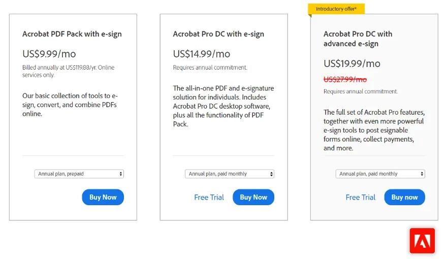

### 按年订阅

用户一次性付一年的费用，比如Microsoft Office 365。👉 [想要更稳定的数据采集方案？试试专业级工具](https://www.scraperapi.com/?fp_ref=coupons)。这种模式下，SaaS公司通常会给年付用户一些折扣，换取他们的长期承诺。

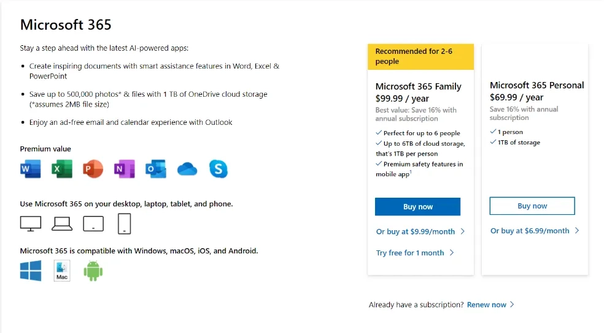

### 按使用量付费

用户根据实际使用量付费。这种模式通常有多个档位：免费版、基础版、高级版、旗舰版。比如SentryKit（一个用AI监控FBA业务的工具）就用这种模式。

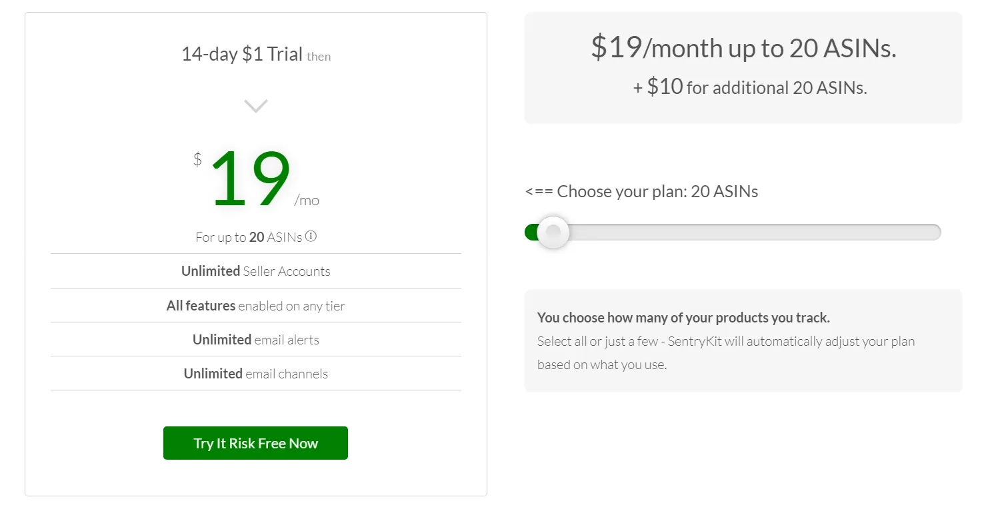

### 混合模式

现在大多数SaaS公司都在用混合模式，根据客户需求灵活组合。比如有些公司会收取固定月费，再加上超出部分的使用费。Call Tracker就是这样：基础月费+通话分钟数+电话号码数量的费用。

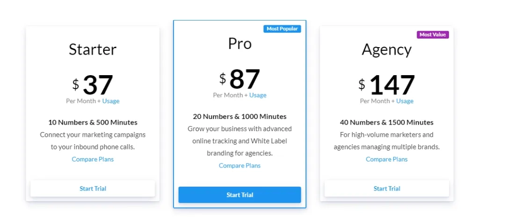

### 免费增值模式

用户可以永久免费使用基础功能。这种模式通常设置使用上限，在免费额度内完全不收费。Spotify和Zoom是最典型的例子：Spotify免费版有广告，Zoom免费版有会议时长限制。

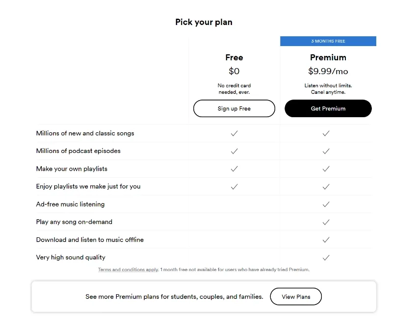

免费增值是获客的绝佳方式。用户用上瘾了，自然会付费升级。即使他们一直停留在免费版，也算是你的用户基础。

### 免费试用模式

比如Philo提供的免费试用：给用户一段时间免费体验，试用期结束后邀请他们参加演示，展示产品价值，引导他们付费订阅。

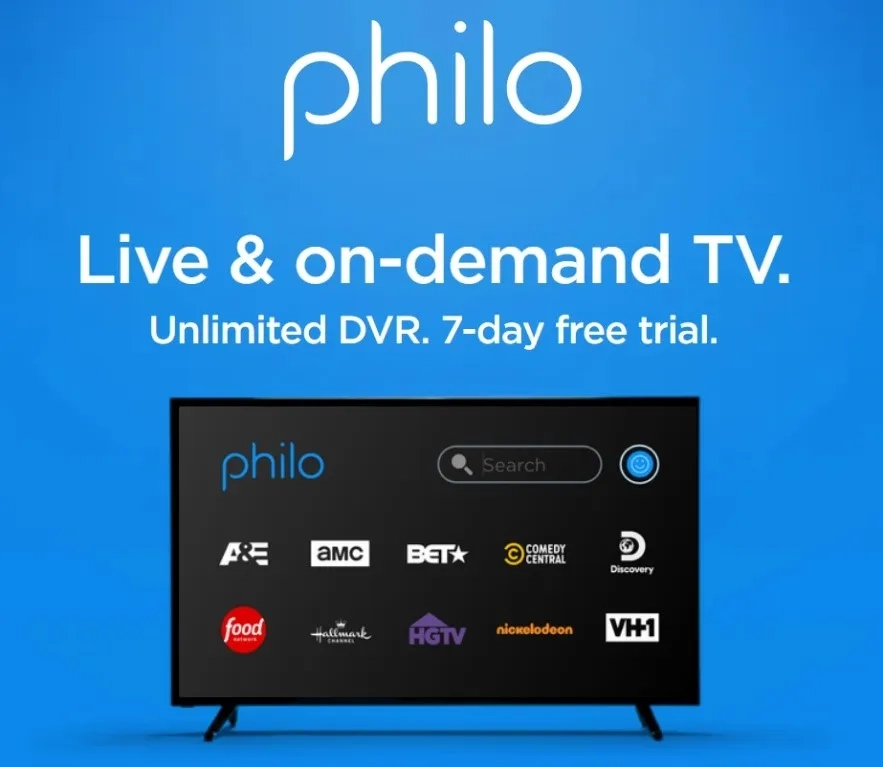

这种模式的核心是转化率——把试用用户变成付费客户。在付费之前，他们都不算真正的客户。

### 制定定价策略时要考虑的事

1. **市场定位**：如果你要做类似Netflix的服务，不可能收50美元/月。看看竞争对手怎么定价，找到合理区间。然后问自己：这个价格能盈利吗？

2. **差异化优势**：你凭什么和别人不一样?如果答不上来，先别急着定价，回去想清楚你的核心竞争力。

有些SaaS创始人会采取"先低价+高配额"的策略，让用户习惯使用更多功能。虽然初期亏钱，但等用户上瘾后，即使涨价或调整套餐，他们也不会轻易降级。

## 关键指标不能忽视

在设计定价和打磨竞争力的时候，这些指标得盯紧。但Product Mint的Viktor提醒过："别陷入KPI过载——追踪太多指标会分散注意力，反而阻碍增长。"关注重点指标就够了。

**获客成本（CAC）**  
通过销售和营销活动获得一个新客户要花多少钱。拉新很贵，定价时必须考虑这个成本。

**月度经常性收入/年度经常性收入（MRR/ARR）**  
预测你的公司每月或每年能赚多少钱。

**留存率**  
对SaaS公司至关重要。包括客户留存率和收入留存率。注意：留住了客户不等于留住了收入。比如你的客户都在，但他们纷纷降级到便宜套餐，那客户留存率是100%，但收入留存率会大幅下降。

**流失率（Churn）**  
有多少客户停止付费了。SaaS的核心就是证明产品价值，让客户觉得这钱花得值。你的目标是降低流失率，最好做到负流失（现有客户升级带来的收入增长超过流失收入）。

如果流失率高，赶紧看看获客成本和获客渠道。算算替换流失用户要花多少钱，看看是不是所有渠道都用上了——自然搜索、付费广告、联盟营销、外呼营销等等。

只提供单一月度套餐的公司，往往流失率更高。假设你收50美元/月，客服时间是朝九晚五。但有些客户愿意付75美元/月换取全天候客服。这种情况下，他们可能就跑去竞争对手那里了。所以你需要分级定价，满足不同用户的需求。

## 真实案例：他们是怎么成功的

不管你的SaaS处于起步期、成长期还是成熟期，永远别忘了终极目标：留住客户，持续赚钱。这里有几个实战案例：

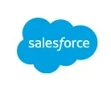

**模式：** 按用户数计费，年度结算

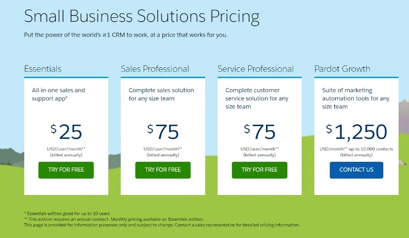

**成功原因：**  
Mike McCann分析过："Salesforce刚进入市场时，Oracle和SAP这些竞争对手都在收高昂的固定费用——硬件、软件、升级、支持，全都要钱。Salesforce改变了游戏规则，按用户数收费，年度结算。后来一堆云端应用都学他们，证明Salesforce是真正的行业领导者。"

**你能学到什么：**  
适应客户需求，研究竞争对手。创建一套能服务初创公司和行业巨头的体系，建立客户信任。

---

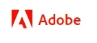

**模式：** 月度订阅，单应用或全套应用

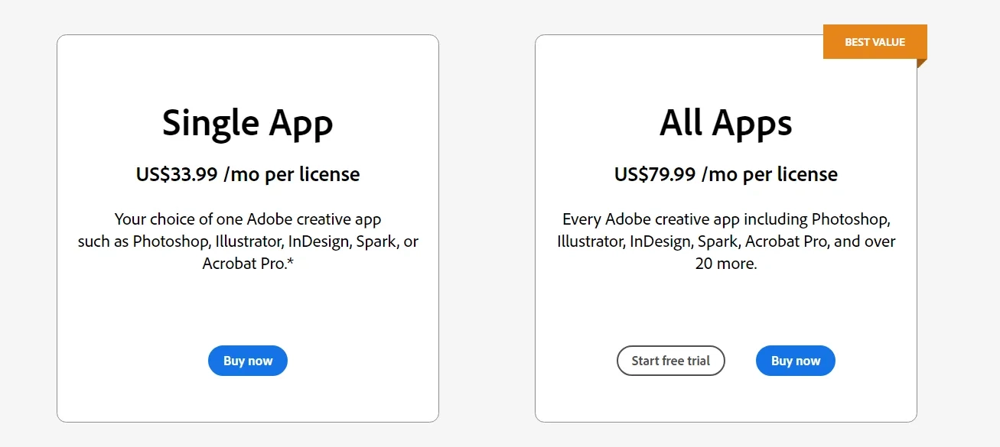

**成功原因：**  
Adobe从一开始就想得长远："他们的第一款产品PostScript大获成功，完全不需要急着增加收入来源。但管理层知道，长期依赖单一产品不是明智的财务决策。所以他们开始开发新应用，瞄准新用户群体，虽然这些产品短期内不赚大钱，但为PostScript提供了收入支撑。"

**你能学到什么：**  
SaaS生意要不断适应市场。看到趋势就抓住，别让固执阻碍你跟上时代变化。

---

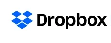

**模式：** 免费增值+月度订阅

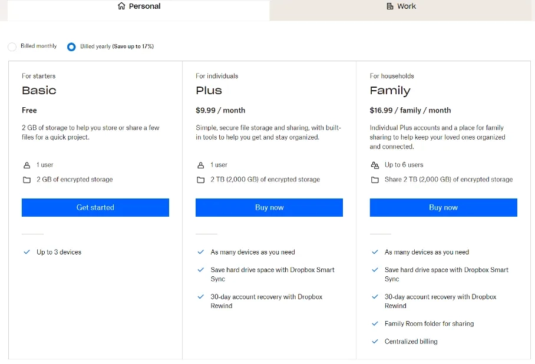

**成功原因：**  
Press Farm的Ian解释过："Dropbox不在乎几百万用户用2GB免费空间不付钱，因为他们的目标是吸引尽可能多的用户，然后向企业用户追加销售。这个策略向用户传递了明确信号：免费用户和付费用户同样重要。提供免费空间这招简单却有效，帮他们建立了数百万用户基础，然后再向这些人推销付费订阅。实际上，很多付费客户就是从免费版转化过来的。"

**你能学到什么：**  
基础套餐的非付费用户和高级套餐的付费用户同样重要。客户留存是关键，对待每个客户都要一视同仁。

---

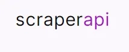

**模式：** 免费试用+按量付费+月度订阅

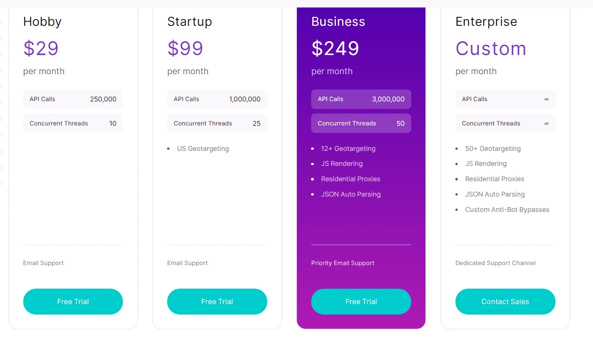

**成功原因：**  
ScraperAPI的成功在于围绕客户需求设计产品和定价。他们的套餐能满足各种需求，还提供定制化方案。所有套餐都包含7×24小时专业支持和无限带宽，还有7天退款保证。客户永远是第一位。

专业的客户支持是核心。ScraperAPI配备了专职客户经理，直接对接工程团队，确保软件满足所有数据采集需求。遇到问题绝不会让客户干等着。

---

## 写在最后

不管你是刚有想法，还是已经开始运营，SaaS生意的本质都是一样的：留住客户，持续赚钱。选对商业模式，定好价格，提供优质服务，其他的自然会水到渠成。

如果你正在考虑数据采集或网络爬虫方案，👉 [ScraperAPI提供灵活的定价和专业支持](https://www.scraperapi.com/?fp_ref=coupons)，值得一试。记住：好的SaaS产品不是一次性交易，而是长期合作的开始。
